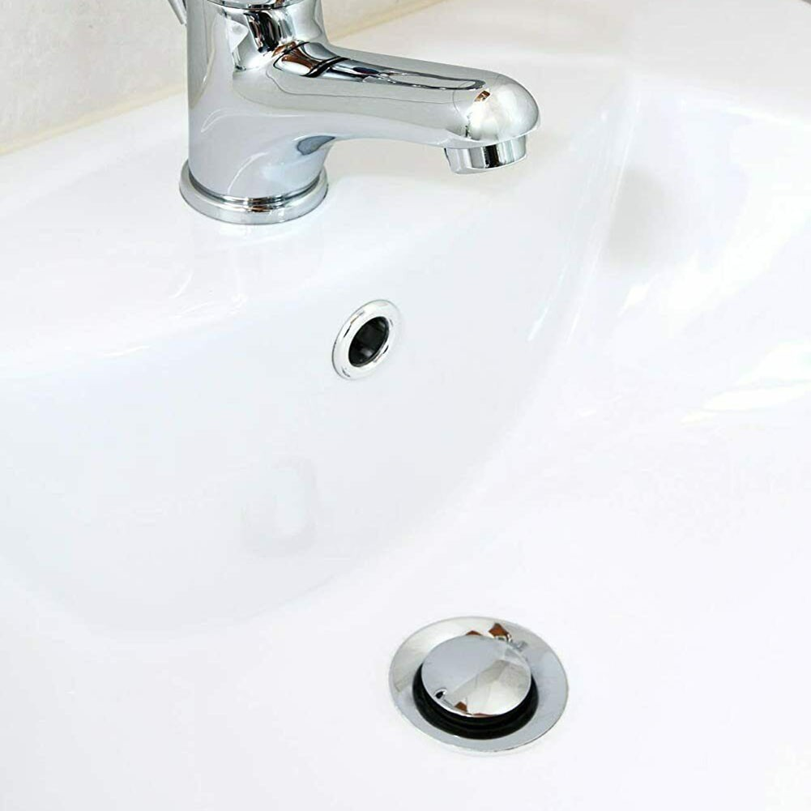
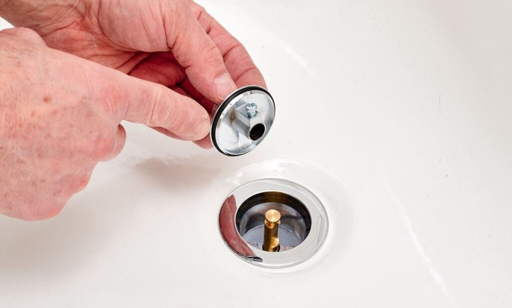
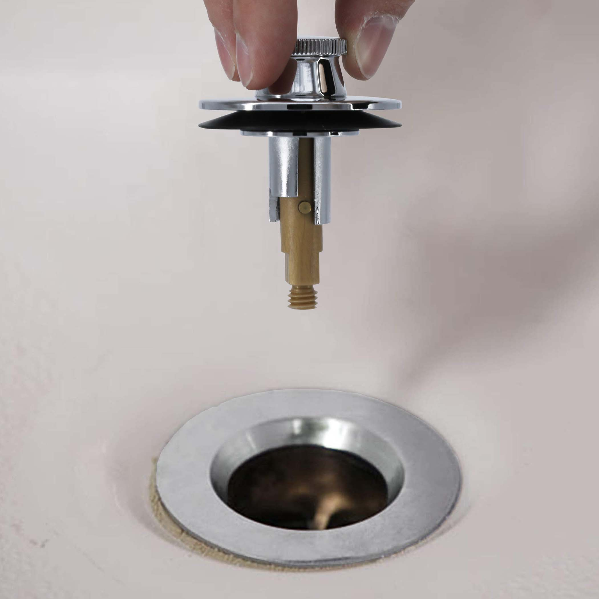

# What Type of Stoppers Are There? {#concept-8556 .concept}

Introduction to a list of common stoppers, helping users identify their drain stopper.

**List of Drain Stoppers**

|1. Pop-Up Stopper|
|-----------------|
|The first and most common sink stopper found in households are the pop ups. The easiest indicator of this type of stopper is locating whether your sink has a lift rod. If it does, then that is how you know your sink is a pop up drain.|

|2. Push and Pull Stopper|
|------------------------|
|The second sink blocker is the push and pull stopper, which requires you to pull the stopper to drain and push it back down to plug. If you are able to do these actions, then your sink is a push and pull drain.|

|3. Lift and Turn Stopper|
|------------------------|
|The last type of drain stopper is the lift and turn stopper, which can resemble a push and pull stopper. To test whether it is a the correct stopper, lift the stopper up and if it needs to be twisted to stay in position to drain then it is a lift and turn stopper.|

**Related information**  

[Click to see more drain stoppers](https://engineerfix.com/what-are-the-different-types-of-bathroom-sink-stoppers/)

